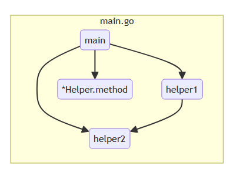

# GoFunCaller (gfc)

Static call graph generator for Go projects. Produces MermaidJS diagrams and text reports from AST analysis — no runtime instrumentation needed.

## Features

- **MermaidJS diagram** — interactive HTML with file subgraphs and function nodes
- **Caller → Callee report** — plain text edge list
- **Reference count report** — functions ranked by incoming calls
- **Reachability filter** — only shows functions reachable from `main()` and `init()`
- **Receiver method resolution** — correctly links `g.method()` to `*CallGraph.method`
- **Zero dependencies** — uses only Go standard library (`go/ast`, `go/parser`)
- **Self-contained HTML** — MermaidJS (v10) embedded into binary, no CDN, no network

## Install

```bash
go install github.com/goupdate/gofuncaller/cmd/gfc@latest
```

## Usage

```bash
# Current directory
gfc

# Specific directory
gfc ./pkg/myservice

# Another project
gfc ~/go/src/github.com/user/project
```

Output files:

| File | Description |
|---|---|
| `callgraph.html` | Interactive MermaidJS diagram |
| `callgraph_calls.txt` | `file: caller → file: callee` |
| `callgraph_refs.txt` | `file: function — N refs` |

## Example



Given:

```go
package main

func main() {
    helper1()
    helper2()
}

func helper1() { helper2() }
func helper2() {}
func unreachable() {} // ← filtered out
```

**callgraph_calls.txt**:
```
main.go: main → main.go: helper1
main.go: main → main.go: helper2
main.go: helper1 → main.go: helper2
```

**callgraph_refs.txt**:
```
main.go: helper2 — 2
main.go: helper1 — 1
main.go: main — 0
```

## License

MIT